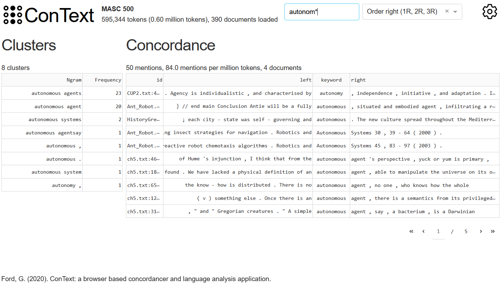

# ConText

A browser-based concordancer and language analysis application.

This repo builds on work done in 2020 on a Python library, Jupyter Notebook and Dash application for the Mapping LAWS project. This work prototyped a browser-based alternative to desktop applications for corpus analysis. Ideas for this tool originated during my PhD thesis, which developed a browser-based analysis tool around a corpus of parliamentary discourse enabling rapid queries, new forms of analysis and browseable connections between different levels of analysis. 

ConText builds on [Conc](https://github.com/polsci/conc), a Python library for corpus analysis. 

## Design principles

### Embed ConText

A key principle is to embed context from the texts, corpus and beyond into the application. This includes design choices to make the text, metadata and origin of the text visible and accessible. The text corpus can be navigated (and read) via a concordancer that sits alongside the text. To aid the researcher in interpretation and sense-making, quantifications are directly linked to the texts they relate to. 

### Efficiency

The software prioritises speed through pre-processing via [Conc](https://github.com/polsci/conc). Intensive processing (tokenising, creating indexes, pre-computing useful counts) happens when the corpus is first built. This is done once and stored. This speeds up subsequent queries and statistical calculations. The frontend is minimal and lightweight.

## Software libraries used

* Conc
* Flask
* htmx
* hyperscript
